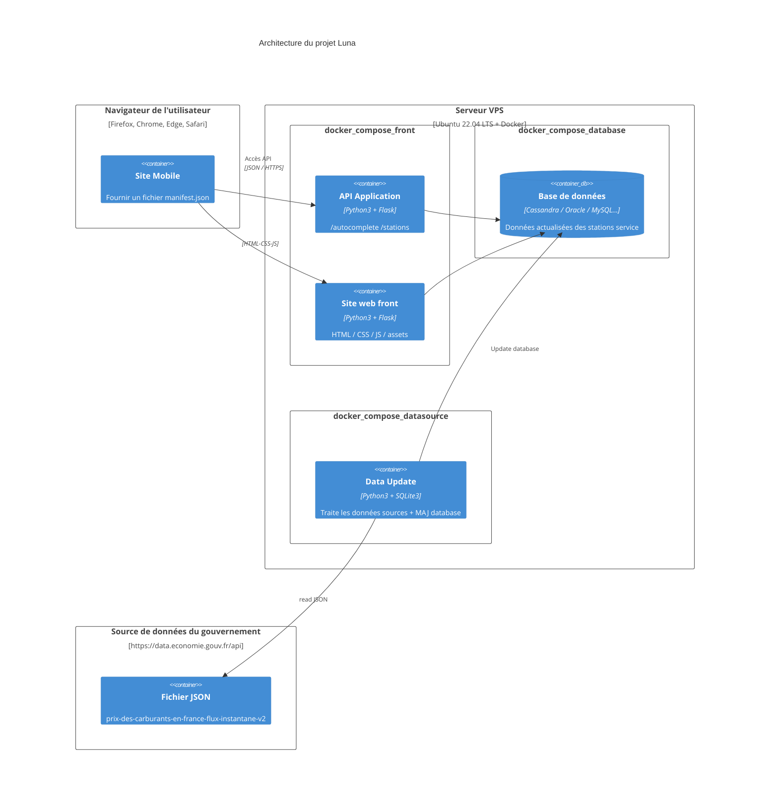
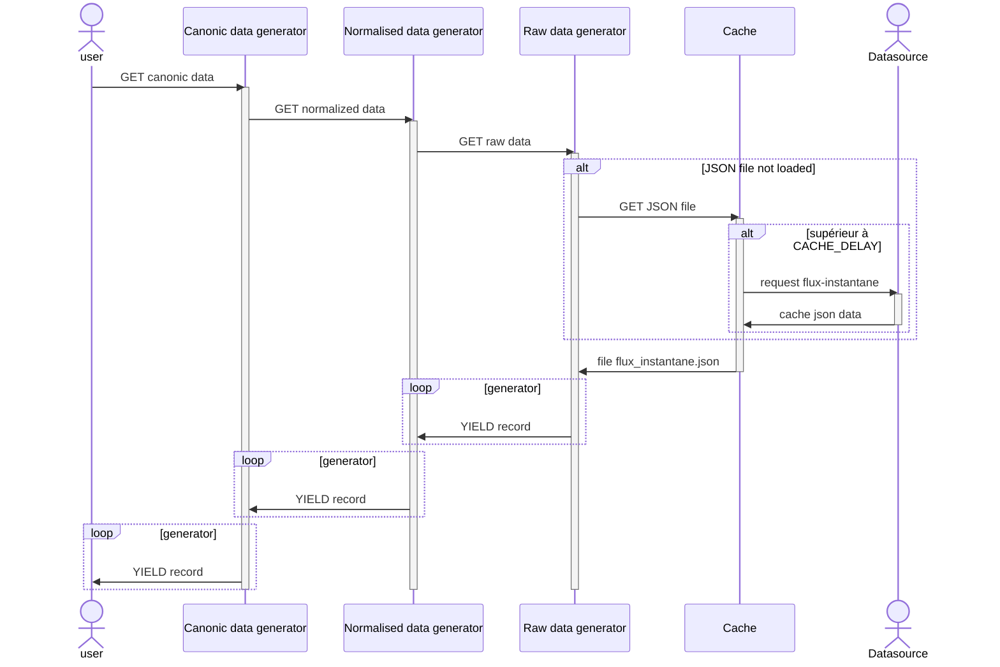
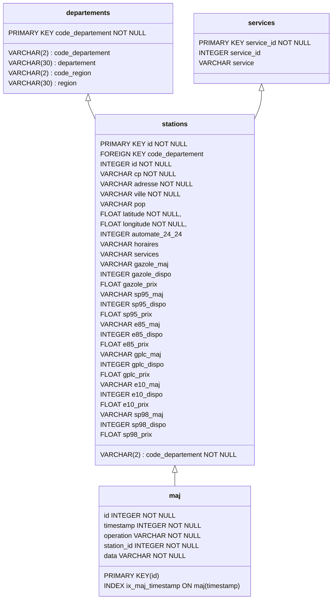

# Projet Luna

## Description du système

### 0 - Architecture



### 1 - Schéma du traitement de données de la source

Les étapes de traitement de données sont construites sous forme de générateurs.

- **rawdata_generator**: données brutes provenant de la source de données
- **normalized_generator**: données dans un format homogène, garantissant:
    - Tous les champs existent
    - Les champs obligatoires sont initialisés
    - les données sont dans le bon type de données
    - Les valeurs None sont intialisées
- **canonical_generator**: données contrôlées dans leur forme canonique, garantissant:
    - les données apparaissant dans 2 champs sont identiques
    - la structure des attributs est simplifiée



### 2 - database interface

Fichier: db_interface.sqlite

```SQL
sqlite> .fullschema
CREATE TABLE departements (
	code_departement VARCHAR(2) NOT NULL, 
	departement VARCHAR(30), 
	code_region VARCHAR(2), 
	region VARCHAR(30), 
	PRIMARY KEY (code_departement)
);
CREATE TABLE services (
	service_id INTEGER NOT NULL, 
	service VARCHAR, 
	PRIMARY KEY (service_id)
);
CREATE TABLE stations (
	id INTEGER NOT NULL, 
	cp VARCHAR NOT NULL, 
	adresse VARCHAR NOT NULL, 
	ville VARCHAR NOT NULL, 
	pop VARCHAR, 
	code_departement VARCHAR(2) NOT NULL, 
	latitude FLOAT NOT NULL, 
	longitude FLOAT NOT NULL, 
	automate_24_24 INTEGER, 
	horaires VARCHAR, 
	services VARCHAR, 
	gazole_maj VARCHAR, 
	gazole_dispo INTEGER, 
	gazole_prix FLOAT, 
	sp95_maj VARCHAR, 
	sp95_dispo INTEGER, 
	sp95_prix FLOAT, 
	e85_maj VARCHAR, 
	e85_dispo INTEGER, 
	e85_prix FLOAT, 
	gplc_maj VARCHAR, 
	gplc_dispo INTEGER, 
	gplc_prix FLOAT, 
	e10_maj VARCHAR, 
	e10_dispo INTEGER, 
	e10_prix FLOAT, 
	sp98_maj VARCHAR, 
	sp98_dispo INTEGER, 
	sp98_prix FLOAT, 
	PRIMARY KEY (id), 
	FOREIGN KEY(code_departement) REFERENCES departements (code_departement)
);
CREATE TABLE maj (
	id INTEGER NOT NULL, 
	timestamp INTEGER NOT NULL, 
	operation VARCHAR NOT NULL, 
	station_id INTEGER NOT NULL, 
	data VARCHAR NOT NULL, 
	PRIMARY KEY (id)
);
CREATE INDEX ix_maj_timestamp ON maj (timestamp);
```


